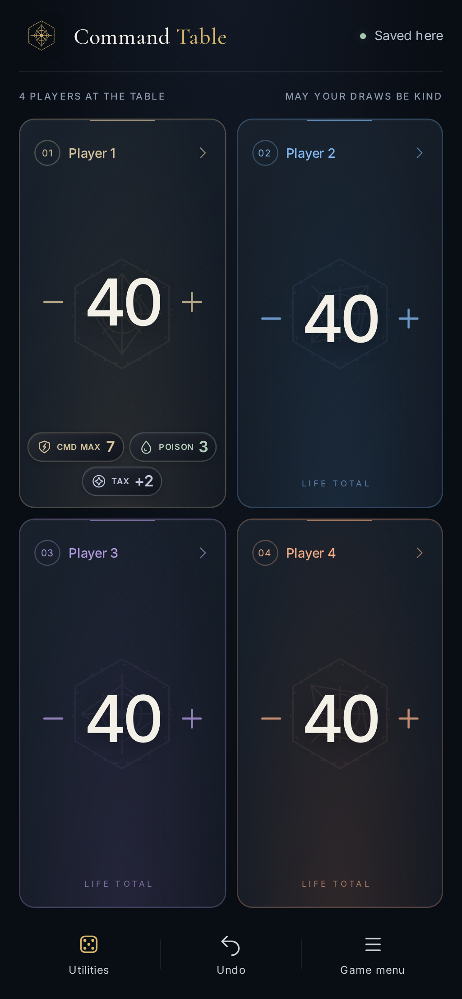
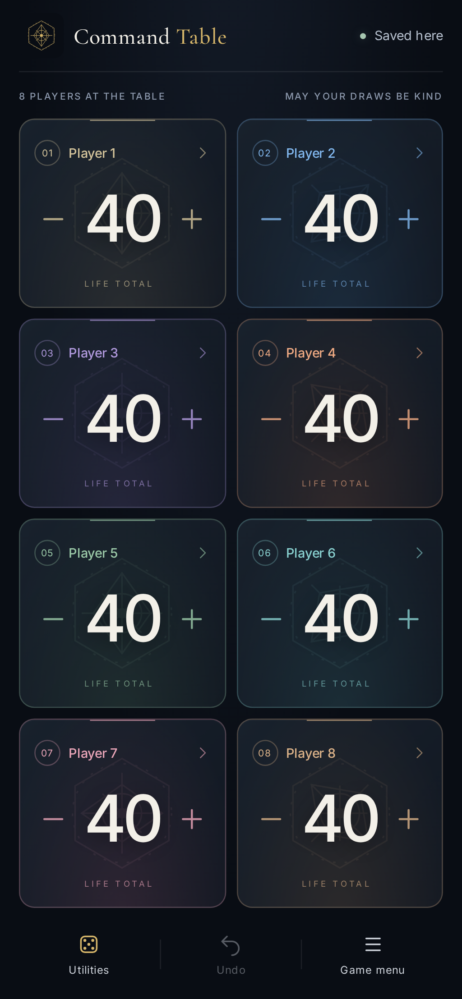

# Command Table

A mobile-first companion for a physical Magic table. Track one to eight players on **One device**, or create a **Shared room** and invite friends by code, link, or QR. Players join in a browser with no accounts or client installation. Hosts run the app with Docker.

Start with the [Docker installation](#docker) below to host on your own computer or server and receive app updates. See the [v0.2.0 release notes](docs/releases/v0.2.0.md) for the latest changes.

**Source-available for noncommercial use:** free to use, modify, and share under the [PolyForm Noncommercial License 1.0.0](LICENSE). Commercial use is not licensed. See [licensing](#publication-and-project-scope) for the scope and earlier releases.

Commander damage belongs to individual commanders, including partners and your own commanders. Life, poison, cast counts, optional turns, timers, dice, and first-player selection share the same game model in both modes. Warnings are reminders; elimination and rules decisions stay with the players.

| Player-status badges                                                                                    | Eight-player table                                              |
| ------------------------------------------------------------------------------------------------------- | --------------------------------------------------------------- |
|  |  |

## Docker

Use the published image for regular hosting, including on your own hardware. The image includes the app and its runtime; you do not need to install Node.js, npm or a compiler on the host.

### Install

1. Install [Docker with Compose](https://docs.docker.com/compose/install/) on the computer that will host the app. See [hardware and operating systems](docs/deployment.md#hardware-and-operating-systems) for the Docker setup to use on your machine.
2. Download [compose.yaml](https://github.com/Addison16/commanders-table/releases/latest/download/compose.yaml) and [docker.env.example](https://github.com/Addison16/commanders-table/releases/latest/download/docker.env.example) into the same folder. Copy `docker.env.example` to `.env`. A source checkout uses `.env.docker.example` instead.
3. Edit `.env`: keep `MTG_IMAGE=ghcr.io/addison16/commanders-table:latest` and set `PUBLIC_ORIGIN` to the exact URL every player will open. For a home network, use your server's address, for example:

   ```dotenv
   PUBLIC_ORIGIN=http://192.168.1.50:8080
   ALLOW_INSECURE_HTTP=true
   MTG_IMAGE=ghcr.io/addison16/commanders-table:latest
   ```

4. In that folder, start the app:

   ```sh
   docker compose -p mtg-util -f compose.yaml pull
   docker compose -p mtg-util -f compose.yaml up -d
   docker compose -p mtg-util -f compose.yaml ps
   ```

5. Open your configured address on your phone or computer. For the example above, that is **http://192.168.1.50:8080**. A phone's `localhost` refers to the phone, so use the server's address for shared play.

For reference, the image pull command is:

```sh
docker pull ghcr.io/addison16/commanders-table:latest
```

Compose handles the download, configuration and persistent storage together. The image supports `amd64` and `arm64` hosts. A single container serves the frontend and shared-room server on port 8080; server data stays in the named volume `mtg-util_mtg-util-data`.

Command Table was previously named Commander's Table. The GitHub repository and Docker image still use `commanders-table`, so existing image references, saves and room memberships continue to work.

For public access or installable/offline phone support, configure HTTPS and `ALLOW_INSECURE_HTTP=false` using the [Docker deployment guide](docs/deployment.md#https-through-a-proxy). Keep the chosen address stable so browser saves and guest sessions stay associated with it.

### Update

Keep the app running in Docker. [Create a verified backup](docs/deployment.md#back-up), then run these commands from the same folder:

```sh
docker compose -p mtg-util -f compose.yaml pull
docker compose -p mtg-util -f compose.yaml up -d
docker compose -p mtg-util -f compose.yaml ps
```

The `latest` tag follows stable releases. Pull downloads the new image; `up -d` recreates the container with it while preserving the mounted data volume. Keep the same Compose project name, `.env`, volume and public origin. Do not use `down -v` when updating: it deletes the server data. Browser-local games remain in their browsers.

Updates are applied when you run these commands or update through your Docker manager; selecting `latest` does not restart containers automatically. Players can tap **Save & update** when the browser update prompt appears. To stay on a fixed release, set `MTG_IMAGE` to a published version such as `ghcr.io/addison16/commanders-table:0.2.0`, or to an image digest. See [backup, restore and updates](docs/deployment.md) for details.

## Play

- Choose **Quick 4 · 40 life**, **Quick 2 · 20 life**, or customize a table. Tap life controls or hold to repeat. Open a player's name for **Edit player & commanders**, exact values, poison, commander tools, and rotation. **Save changes** saves the player name, color and commander names/artwork together; Undo restores the whole edit. Recorded damage and casts stay intact. Undo groups an uninterrupted hold while each increment is saved immediately.
- Small player-card badges appear when a tracker has a value: **CMD MAX** shows the highest damage received from any one commander, **POISON** shows poison counters, and **TAX** shows the additional mana for the next command-zone cast. Partners keep separate **TAX I / TAX II** badges. Poison and commander-damage warnings use your configured thresholds. Open the player's name for the full breakdown and corrections; zero or disabled trackers stay hidden.
- Phones and tablets automatically use **Shared table** in landscape and **All facing me** in portrait. In a four-player shared table, the top two counters face the far side, the bottom two face you, and larger +/− areas are easy to reach. Rotation preserves the game and each shared guest’s **My seat** selection. **Game menu → Table layout → Follow device rotation** controls this behavior. Choosing a layout or flipping an individual seat turns automatic switching off on that device; turn it back on to follow rotation again. Desktop layouts stay manual.
- To share, choose **Create room**, choose a table size, and open **Live room** for the code and QR. Friends enter their name, choose their own player name and one or two commanders in the lobby, then request a seat. The host previews their choices and taps **Approve seat**; the names appear on everyone's board without resetting any totals. Commander names can be left for later, and commander fields stay hidden when those tools are off. Pending choices survive refresh and can be revised with **Update request**. Pending guests cannot see the game.
- Hosts control every seat. Approved guests control their own numerical trackers, player name, and commander labels, and can roll dice. The host may enable **Friends can edit every seat** for numerical adjustments; this does not grant administration or another player's name edits. **My seat** makes a guest's controls larger.
- **Commander artwork** is optional in setup, joining, and **Edit player & commanders**. Type a name and choose a suggested card, or paste a Scryfall card link and tap **Find artwork**. During play, tap **Save changes** to save the selected art with the rest of the player details; partners share the panel. Artwork follows approved guests, saved games and rematches. **Remove artwork** restores the plain background after saving. Player details show artist credits and a link to the full card. Manual names still work without artwork or internet.
- To read another player's commander, tap their name/profile and choose **View commander**. The full card appears with readable rules text, mana cost, type and stats. Select either partner or switch faces on a double-faced card. **Rulings & notes** loads Scryfall's card-specific rulings with dates and source attribution. Rulings can be retried independently if lookup fails; previously loaded rulings stay available in the current tab for up to one hour, including during an outage. Saved names work even without selected artwork. Viewing is read-only: approved guests can read any player's commander without gaining permission to edit that seat.
- **Utilities → Group life change** applies one effect to selected opponents. Choose the caster first; all other active players are selected initially, and you can deselect anyone unaffected. The caster cannot be selected for life loss. Enter life lost per opponent and, optionally, the **total** life the caster gains; gain is never guessed or multiplied. Review each before/after total, then apply. One Undo reverses the whole effect. In shared rooms only the host can apply it, even when friends can edit individual seats. If the table changes before saving, review the effect again. If a save is not confirmed, check totals/history and clear the form before starting another effect. Card rules, prevention and replacement effects remain the players' decision; this tool changes life only.
- **Utilities** rolls polished 3D dice over the life-counter board, with rounded edges/corners, subtle grain and engraved numbers. **Roll for** matches the pearl body to a player’s seat color; local rolls default to the last player saved or selected, and shared guests default to their own seat. Table rolls keep the original ivory finish. Rerolls, percentile pairs and replays keep the selected player. The result face lands centered and upright. Each player gets a matching colored die in **d20 for everyone**; tied leaders roll again before the starting player is revealed. Every approved room member can roll for the table. Results are saved before animation; skipping or reopening a result never rolls again. Sound effects add a dice clatter; **Display & preferences → Test dice sound** previews it.
- **Turn tracking** is off by default. Enable it in Utilities to show a compact **Next turn** button beside Undo; shared turn controls belong to the host. The game timer is also in Utilities.
- **New game** asks **One phone** or **Multiple phones** again and opens a fresh setup with default players, colors, commanders and settings. Previous player details do not carry over; choose a preset and starting life for the new table. Tap the **Command Table** logo for Home and the last ten unfinished local/shared games. **Resume** reopens the original local game with its names, totals, and history, or reconnects to a shared room using the current guest cookie.
- **End game** offers **Rematch**, **End game** or **Cancel**. **Rematch** keeps the current player names, colors, commanders/artwork and shared seats, restores the configured starting life (including custom values), and clears counters, damage, commander casts, markers, elimination, turns, timer, dice and undo history. Names and commanders remain editable in player details. Choosing **End game** returns everyone to the starting options after the ending is saved. **Recently ended** keeps up to ten recent games available for 24 hours. **Reopen** restores the original totals, damage, commanders and history; the timer stays paused. In shared rooms, only the host can reopen play, and existing seat assignments remain intact. **View final game** lets you inspect a finished game and still use its dice. Starting another game does not remove the recovery entry. Expired recovery entries disappear; existing archives and server retention remain separate.
- **Game menu → Share game recap** creates a PNG with player colors, names, commanders, life totals and game duration. During play it is marked **In progress**. For a final recap, end the game, choose **View final game** from Home, then open the recap. You can optionally select a winner or draw for the image; the app never guesses a winner or changes the saved game. Use **Share image** where supported, or **Download PNG**. The image is generated on your device with no external artwork requests.
- **Game menu** also offers history, settings, export/import, rematch, and archived local games. A rematch keeps room assignments and seat identities. A new shared setup creates a new room; previous unfinished rooms stay resumable. Local archives and the unfinished-game list are each bounded to ten stored entries.

If a shared connection drops, new edits pause. Reconnecting accounts for already-submitted actions before enabling controls. **Continue a copy on this device** forks the last confirmed game into independent local play; it never merges back into the room.

## What is remembered

| Data                                          | Location and lifetime                                                |
| --------------------------------------------- | -------------------------------------------------------------------- |
| Local game, ten recent games, preferences     | IndexedDB in this browser at this exact scheme, host, and port       |
| Shared games, memberships, operation receipts | Server SQLite volume; inactive rooms expire after 30 days by default |
| Guest authority                               | Persistent HttpOnly cookie with a rolling 90-day lifetime by default |
| Local installation ID                         | Random organizational ID; never a login or room credential           |

Clearing site data, switching browser profiles, or changing the URL can lose local access. **Export game backup** creates portable JSON without credentials. Import validates the file and creates a local game, preserving the receiving browser's identity. Server backups do not include browser-local games.

Losing a guest cookie means requesting host approval for a replacement seat. A lost host cookie has no invitation-code recovery; transfer host to another approved guest before leaving when appropriate. Heartbeats alone do not keep an inactive room alive. Room details show its expiry and previous match exports.

If browser storage is blocked, local play continues in memory with a visible warning. Export before leaving. Unreadable or future-version saves are preserved for recovery rather than silently reset.

## Offline and installation

One-device play works without a guest session or network connection. A production build can reopen offline after its service worker has installed through HTTPS or localhost. Plain HTTP on a LAN supports core play and saving, but is not a secure context for offline installation or wake lock.

Looking up new artwork requires internet access. Selected card metadata is saved with the game. On an installed production app, viewed Scryfall art crops are cached separately (up to 64 images for 30 days); uncached or unavailable artwork falls back to the normal panel while counters keep working.

Commander card and ruling lookups also require internet access. Recently read card text and rulings can reopen from the current tab's memory for up to one hour, including during a connection outage. Reloading clears those text caches; full card images are not guaranteed to work offline. If an image cannot load, available card text remains readable. Group life changes in one-device games and recap PNG exports work offline after the app has loaded.

On iPhone Safari, use **Share → Add to Home Screen**. On Android, use the browser's install/home-screen menu. Installed apps and ordinary browser tabs can have separate storage. Settings explain optional fullscreen, vibration, sound, and keep-awake behavior. System reduced motion always takes priority. Updates wait for **Save & update**, then confirmation; they do not force a reload during play.

## Development

Use **Node 24 LTS** (`.nvmrc`) and npm. A compiler toolchain (Python 3, make, and a C++ compiler on Linux) is needed if the native SQLite dependency cannot use a prebuilt binary.

```sh
npm ci
npm run dev
```

Open **http://localhost:5173**. This starts Vite and the API server together; Vite proxies HTTP and WebSockets to port 8080. Development data goes in ignored `.mtg-data/`. Use the published Docker image above for regular hosting and updates.

For phones on the same network, replace the example address with your computer's LAN IP:

```sh
PUBLIC_ORIGIN=http://192.168.1.50:5173 ALLOW_INSECURE_HTTP=true npm run dev
```

Open **that exact address** on the computer and every phone. A phone's `localhost` refers to the phone. Allow port 5173 through your local firewall if needed; the development proxy uses API port 8080 internally. Avoid exposing a development server publicly.

For testing a production build directly during development:

```sh
npm run build
PUBLIC_ORIGIN=http://localhost:8080 ALLOW_INSECURE_HTTP=true npm start
```

`npm start` serves both the built frontend and backend at port 8080. Optional configuration can be copied from `.env.example` to `.env`; explicit environment variables take precedence. The example `.env` uses **5173 for development**: change `PUBLIC_ORIGIN` to the actual production address before starting or sharing a room.

### Build a development image

Contributors can test source changes in Docker too. From a source checkout, run:

```sh
PUBLIC_ORIGIN=http://localhost:8080 ALLOW_INSECURE_HTTP=true \
  docker compose -p mtg-util -f compose.local.yaml up -d --build
```

This builds your checkout rather than downloading a release. For regular hosting and image updates, use `compose.yaml` and the published `latest` image. Both examples use the same project and volume; run only one at a time. Details are in the [local image guide](docs/deployment.md#start-a-locally-built-image).

## Checks

```sh
npm run lint
npm run typecheck
npm test
npm run build
npx playwright install --with-deps chromium webkit
npm run test:e2e
npm run test:pwa
npm run test:proxy
npm run test:lan
docker build -t mtg-util:local .
npm run test:container
```

`test:e2e` starts development servers when needed. `test:pwa` starts a temporary production server and verifies offline reopening and prompted updates in both browser engines. `test:proxy` requires OpenSSL and verifies HTTPS cookies and WSS using a temporary certificate. Container checks use their own temporary volumes.

See [testing evidence and the physical-device checklist](docs/testing.md), [architecture](docs/architecture.md), [milestone status](docs/progress.md), and [asset licenses](docs/assets.md). Automated browser coverage is not a claim of physical iPhone/Android validation.

## Publication and project scope

Starting with v0.1.2, application code, documentation, and original artwork are available under the [PolyForm Noncommercial License 1.0.0](LICENSE), SPDX identifier `PolyForm-Noncommercial-1.0.0`. You may use, modify, self-host, and share the app for noncommercial purposes, retaining the license terms and required notice.

Commercial use is not granted, including resale, paid hosting, and use for commercial purposes even when no copy is sold. The license defines its permitted personal and noncommercial organizational uses. These terms are **source-available, not OSI open source**; see the full [license](LICENSE) and [official license text](https://polyformproject.org/licenses/noncommercial/1.0.0).

**Earlier releases keep their original permissions:** [v0.1.0 remains MIT](https://github.com/Addison16/commanders-table/blob/v0.1.0/LICENSE), and [v0.1.1 remains MIT with Commons Clause](https://github.com/Addison16/commanders-table/blob/v0.1.1/LICENSE). This change does not revoke permissions already granted for those releases or code available under their original terms. Bundled fonts and dependencies retain their separate licenses; see [asset licenses](docs/assets.md).

The release workflow verifies the app, Chromium/WebKit journeys, offline updates, HTTPS/WebSockets, and native amd64/arm64 containers before publishing GHCR images and GitHub release downloads. Maintainers publish updates by bumping the package version and pushing a matching `vX.Y.Z` tag; see [publishing a release](docs/deployment.md#publishing-a-release).

This is an independent manual tracker, not a Wizards of the Coast product or a rules engine. Accounts, card databases, team-format automation, and multi-server deployment are outside this release. The original specification remains in [BUILD_PLAN.md](BUILD_PLAN.md).
